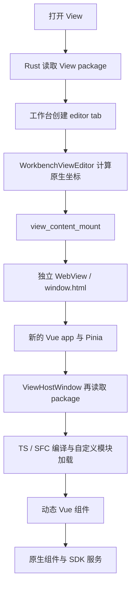
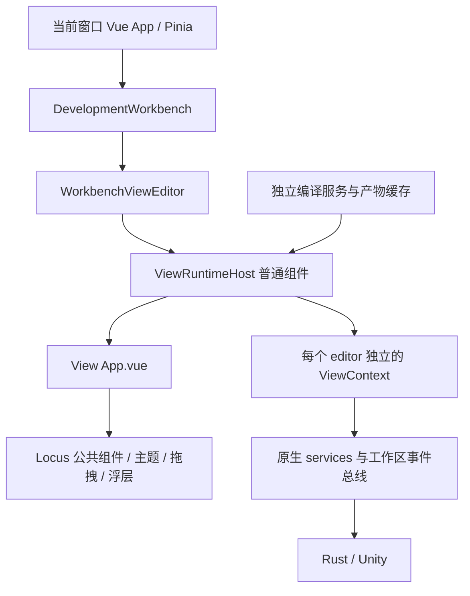
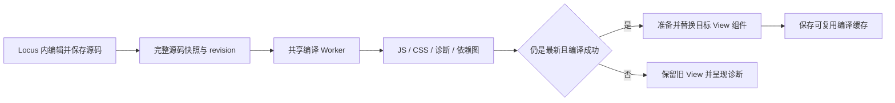

# Locus View 运行机制与原生嵌入 Review

2026-09-07。本文记录迁移前的机制 review 与方案；后续已按用户要求实施。当前实现与验证见 [View 原生运行时](view-native-runtime.md)。相关文件同时存在其他工作的修改。

用户确认的目标：View 嵌入工作台，复用 Locus 原生组件、服务和上下文。进一步明确：工作台内的 View 可以取消独立 WebView；实际发行构建必须支持在 Locus 内修改源码并热更新。

**结论：建议将工作台 View 改成当前 Vue 应用的普通组件子树，并保留发行版内的源码编译能力。** 每个 View 有独立的编辑器上下文和生命周期，但共享当前窗口的 Vue、Pinia、公共组件、主题及服务实现。源码编译应独立于渲染，并由检查和执行共同使用编译产物。预编译只作为首次打开和未修改代码的加速路径，不能成为运行 View 的唯一方式。

## 当前实际运行路径

工作台内看起来是一个面板，实际仍由独立 `WebviewWindow` 承载。Windows 上使用 `SetParent`、`SetWindowPos` 把内容窗口嵌到工作台窗口中。工作台监听布局、窗口移动和缩放，再经 IPC 同步几何信息。[工作台容器](../../src/components/workbench/WorkbenchViewEditor.vue#L32)、[原生挂载](../../src-tauri/src/view.rs#L5054)。

子窗口入口重新执行 `createApp(WindowApp)` 和 `createPinia()`，所以共享的是组件与服务的源码，不是工作台所在应用的响应式实例。[子窗口入口](../../src/window-main.ts#L31)。

已有实现中值得保留的部分：

- `createViewRuntimeComponent()` 返回普通 Vue `Component`；真正渲染已经使用动态组件，并不依赖 iframe。可以将这一层迁入工作台。[运行组件](../../src/components/view/viewRuntime.ts#L2231)。
- `BaseButton`、Unity 字段、属性树、Graph、Canvas 等直接使用 Locus 原组件；全局主题和字体也已有共享入口。[组件注册](../../src/components/view/viewRuntime.ts#L793)。
- 后端 IPC 已有 `WorkspaceRef` 校验，工作台 editor 也能提供自己的工作区绑定。原生嵌入应沿用这一归属关系。
- Unity C# 调用已有源码缓存和 `invoke_named_cached`，仅在需要编译时回退发送源码，不应把这部分误判成每次调用都重新编译。[脚本调用](../../src-tauri/src/view.rs#L6173)。

## 已确认的问题

**[P1] SDK 的编辑器更新订阅没有跟上新的事件路由。**

`onUpdate` 仍订阅裸事件 `unity-editor-update`；Unity transport 现在将事件交给工作区路由器，而路由器向前端发送的是 `locus://workspace-event`，实际事件名在 envelope 中。当前这条链路无法把 Unity 编辑器更新送到 SDK 的该订阅。应像其他原生工作区服务一样，订阅总线并校验 checkout、generation 和 materialization epoch，再交付 payload。[订阅端](../../src/components/ViewHostWindow.vue#L2465)、[Unity 转发端](../../src-tauri/src/unity_bridge/transport.rs#L298)、[前端事件出口](../../src-tauri/src/workspace_service/event.rs#L203)。

**[P1，原生兼容性] `createApp` 兼容层静默丢弃 Vue 应用配置。**

`createVueModule()` 只记录根组件；`use()`、`component()`、`provide()` 都是空操作，也没有完整的 `app.config`。复制原生前端入口后，插件不会安装，应用级注册不会生效。这不是“同样使用 Vue”就能覆盖的差异。[兼容层](../../src/components/view/viewRuntime.ts#L1104)。

本次执行当前函数源码的独立探针：原生 Vue 的 plugin installer 被调用 1 次，View shim 为 0 次；原生全局组件可读取，View shim 读取失败。Vue 对这些 API 的语义有明确约定。[Vue Application API](https://vuejs.org/api/application.html)。

**[P2] 编译检查与运行重复编译，缓存只覆盖局部生命周期。**

管理页选择或打开 View 时遍历文件编译，只保留检查结果；运行窗口随后重新编译模块。运行 loader 的 `Map` 建在每个新 runtime context 内，无法复用检查产物，也不能跨重建复用已编译代码。[管理页检查](../../src/components/ViewPackageView.vue#L559)、[运行模块缓存](../../src/components/view/viewRuntime.ts#L1808)、[运行准备](../../src/components/view/viewRuntime.ts#L2251)。

从管理页首次打开时，源码检查、后端打开、后端创建内容窗口、内容前端读取都可能各读一次 package。`read_view_sync` 扫描 View 的源文件和共享 `src/`，并传输源码内容，窗口创建只需要的元数据与真正编译需要的源码没有分开。[包读取](../../src-tauri/src/view.rs#L3551)、[打开工作台](../../src-tauri/src/view.rs#L5277)、[创建内容窗口](../../src-tauri/src/view.rs#L5182)。

**[P2] 隐藏与销毁策略影响切换成本和面板状态。**

内容窗口隐藏后计划在 30 秒后销毁；在没有 View 自行保存状态的情况下，之后切回需要新建窗口、重建运行时，局部响应式状态和撤销记录不会自动恢复。隐藏期间也没有 SDK 级暂停通知；不能把原生窗口隐藏等同于停止业务订阅和后台任务。[销毁计时](../../src-tauri/src/view.rs#L4957)、[隐藏入口](../../src-tauri/src/view.rs#L5244)。

**[P2] 文件监听资源没有与 View 使用生命周期闭合。**

每个 View watcher 创建线程，以 160 ms 超时等待事件，还会重复监听同一个包工作区的共享 `src/`。内容窗口销毁只清窗口和路径缓存，没有释放 watcher；现有释放点主要是包删除/转移和工作区 runtime 退休。不断打开新 View 会累积监听资源，应改成按规范化目录共享 watcher、引用计数和显式释放。[监听器](../../src-tauri/src/view.rs#L6001)、[窗口销毁](../../src-tauri/src/view.rs#L4984)、[现有释放](../../src-tauri/src/view.rs#L5933)。

**[P2，模块兼容性] 自定义 loader 尚未形成与前端构建一致的模块语义。**

例如后端读取 `.json` 文件，但 View loader 没有 JSON 分支，送进 TS 转译会失败。本次使用当前 loader 函数加载 `{"answer":42}` 得到 `Debug Failure. Output generation failed`。相邻 drawer loader 已单独实现 JSON 解析，说明两套运行时已经出现差异。[View loader](../../src/components/view/viewRuntime.ts#L1808)、[drawer loader](../../src/services/inspectorDrawerExtensions.ts#L168)。

其他限制包括固定的模块映射、CommonJS 执行包装，以及缺少常规资产处理。运行时还复用预览 CSS 清洗，把所有 `url(...)` 替成 `none`、移除 `@import`；`read_view_file` 将单文件截到 96 KiB。这些路径不能原样承担完整的原生扩展构建产物。[CSS 处理](../../src/components/view/viewPackageFiles.ts#L30)、[文件读取上限](../../src-tauri/src/view.rs#L6873)。

**[P2，日志开销] 每条 console 日志都有独立 IPC 和同步文件工作。**

Host 包装当前窗口的全局 console，每条消息都调用追加日志命令。后端每次重新解析 View 路径、读取 manifest、打开文件并追加；读取最近日志时又先读取整个文件。高频日志会把调试成本带进正常运行路径。应使用带实例归属的 logger、批量缓冲、滚动文件和真正的尾部读取。[console 包装](../../src/components/ViewHostWindow.vue#L598)、[日志 I/O](../../src-tauri/src/view.rs#L6195)。

## 构建与验证证据

执行了当前工作区的生产前端构建，输出到独立 `.tmp` 目录，未覆盖通常的 `dist`。结果：

| 项目 | 产物字节数 | 含义 |
| --- | ---: | --- |
| ViewHostWindow 自身 | 43,192 | 只计算 Host chunk 会低估实际依赖 |
| ViewHostWindow 的静态 JS 依赖闭包 | 1,563,940 / 48 chunks | 包含公共 vendor、View runtime 和 Inspector 等依赖 |
| View 编译器主体 chunk | 3,471,257 | 包含该构建分配到此处的编译代码，首次运行动态加载 |
| 公共 vendor | 1,087,392 | `manualChunks` 将 Vue 及 `@vue/*` 等放在一起 |

这些是 minified 文件大小，不是 WebView 内存占用、实际磁盘读取量或启动耗时；闭包存在共享依赖，不能简单相加。没有采集真实 WebView 冷启动 p95 或 RSS，本轮不声称具体加速倍数。ELK 和 three 已有延迟导入，也不能把整个发行目录体积计为首屏成本。

11 个相关 Vitest 文件、47 项测试通过。现有测试主要覆盖编译变换、源码结构约定和 IPC 参数，不能证明插件安装、隐藏/恢复、资源释放等运行时行为正确。独立探针验证了上述 Vue shim 和 JSON 导入差异，并记录了构建依赖闭包。

证据：[review-evidence.json](../../.tmp/view-host-review-20260907/review-evidence.json)；可重复运行的探针：[review-probe.mjs](../../.tmp/view-host-review-20260907/review-probe.mjs)。

## 建议的原生嵌入结构

工作台原本已经以组件方式渲染 Knowledge、Collab 等内容，并传递 editor 自己的 `workspaceRef` 和激活状态。View 可以遵循同样的组织方式，保留当前标签栏和分栏，不增加新的视觉结构。[工作台现有布局](../../src/components/workbench/DevelopmentWorkbench.vue#L7627)。

建议保留 `WorkbenchViewEditor` 作为工作台适配层，将内部坐标同步替换成 `ViewRuntimeHost`。后者加载定义、提供上下文、管理激活和销毁，并通过 `<component :is="resolvedComponent" />` 渲染 View。它是普通 Vue 子树，天然继承当前 app 的插件及祖先注入；不再为每个 tab 创建 app 或 Pinia。

`ViewHostWindow` 则保留为需要真实独立窗口时的外壳，复用同一个 `ViewRuntimeHost`。工作台打开路径不再调用 `view_content_mount`，也不再进行屏幕坐标换算、原生 reparent 和窗口池维护。拖出到另一个真实窗口时，应通过 editor 状态快照重建组件实例，不跨 WebView 搬运 Vue 实例。

共享渲染线程意味着 View 中的重计算也会影响工作台响应。编译、图布局和大数据变换应按需要放到 Worker 或后端；组件、DOM 操作及普通交互留在当前前端。

## SDK 如何与 Locus 前端一致

**同一套实现，按实例绑定上下文。** 将 SDK 提供者从 3,000 多行的窗口组件中抽出，建立由原生页面与 View 共用的组件、composable 和 service 入口；不要再维护一套近似前端行为的实现。可以继续保留 `@locus/components` 与 `@locus/view-runtime` 名称作为兼容入口。

每个 `ViewContext` 至少包含 `viewId`、`editorId`、`paneId`、`windowId`、完整 `WorkspaceRef`、激活状态、生命周期 signal，以及工作台操作和作用域已绑定的服务。主题、字体和语言可共享当前窗口状态；选择、草稿、撤销及会话观察应按 editor 或业务文档归属管理。

“共享 Pinia”不等于“所有操作读取当前 focused checkout”。当前 `unity.select/inspect` 内部读取 `focusedWorkspaceRef`，另一些 Unity API 却使用 `api.workspaceRef`；同窗口放入多个 checkout 的 View 后会产生错目标风险，必须先统一为 editor 绑定的上下文。[当前差异](../../src/components/view/viewRuntime.ts#L496)。

新 View 入口应导出组件或扩展定义，由 Host 挂载；不要求作者重新执行 `createApp`。可设计 `defineView({ component, activate(context) })`，组件通过明确的 `useViewContext()` 获取服务。这里的接口为建议设计，尚未实现。需要影响整个 app 的插件由宿主注册；View 局部依赖通过组件子树的 provide/inject 提供，不继续把配置调用静默忽略。

类型声明应从公共源码入口生成，并配套同版本组件目录和行为测试。现有源码导出脚本可继续作为阅读材料，但复制源码清单不能替代可校验的 SDK 契约。[现有源码导出](../../scripts/export-view-runtime-sources.mjs#L9)。`apiVersion` 目前只要求非空，应增加明确的兼容范围和能力判断。[版本检查](../../src-tauri/src/view.rs#L126)。

## 迁入同一个前端前必须处理的边界

| 边界 | 当前机制 | 迁移要求 |
| --- | --- | --- |
| 实例身份 | 多处以 viewId 为中心 | 编译产物与实例分开；实例绑定 editor 和完整工作区身份 |
| 全局 API | 每次覆盖 `window.locus.view/unity` | 改为实例注入；兼容模块也必须绑定自己的实例 |
| CSS | 样式插入 document.head，允许全局选择器 | 新包使用 scoped styles；旧包做选择器归属处理；浮层复用宿主容器 |
| 日志 | 包装整个 window 的 console | 使用实例 logger，不能让一个 View 接管其他面板日志 |
| 订阅与注册 | 多数 API 返回手动清理函数 | Host 统一记录 disposer；异步晚到的注册也应立即清理 |
| 非活动状态 | 隐藏窗口 / v-show | 显式 suspend/resume；暂停 UI 观察和轮询，不误取消后端会话 |
| 自动化 | 多处按窗口和 document 查找 | 按 editor 实例限定 root，并保留原有 snapshot/action/wait 工具行为 |
| 模块状态 | 当前 loader 每实例有自己的模块缓存 | 共享编译代码，不共享含响应式状态或捕获 SDK 的实例模块导出 |

这里尤其不能把 `createViewRuntimeComponent()` 直接贴到工作台就宣告完成：全局 API、CSS、console 和错误的 focused checkout 读取在独立窗口中不明显，合并到同一个 JS 环境后会变成 View 之间的干扰。

已有 drawer runtime 会跟踪注册的 disposer，可复用这种组织方式，不必新建另一套清理规则。[drawer 生命周期](../../src/services/inspectorDrawerExtensions.ts#L312)。

## 实施顺序与验收

1. **统一上下文与生命周期。** 抽出 SDK factory、View runtime host、自动化 root 和日志接口；修复更新订阅、实例归属及清理。先让独立窗口复用这些公共层，行为测试覆盖异步注册和重载。
2. **工作台直接挂载。** 沿用现有 editor 容器及标签样式，替换原生内容窗口适配；验证多 View、多 checkout、焦点、拖拽、快捷键、浮层、错误呈现及旧工具调用。
3. **统一编译产物。** 检查和运行使用同一份 JS/CSS/diagnostics。发行版继续内置即时源码编译能力，将编译放在独立服务中；包可附带预编译产物作为缓存初值，源码变化后必须在应用内增量编译。对支持的语言和资源建立与原生前端一致的编译约定，Vue、Pinia 和公共 SDK 由宿主提供单例；不承诺无需额外实现即可支持任意 Vite 插件或 Node 构建脚本。
4. **补齐资源和观测。** watcher 共享与引用计数；日志批量与上限；非活动实例暂停；根据测量设置有界缓存，淘汰前处理未保存状态。

编译缓存至少纳入源码内容、依赖图、编译器版本、SDK ABI 和相关编译选项；不要只用 `viewId`、manifest 时间或入口源码判断。源码文件索引使用 Map；源码编译与产物加载不再使用 96 KiB 的展示读取截断。

预编译、按需加载本身也符合 Vue 官方性能建议，但本项目的优先级来自上述实际执行路径和构建结果。[Vue 性能建议](https://vuejs.org/guide/best-practices/performance.html#bundle-size-and-tree-shaking)。

验收应同时记录冷启动、缓存命中、切换、隐藏 60 秒后恢复、热重载、关闭，以及多 View 场景的耗时、长任务、IPC 数、WebView 数、订阅数和 watcher 数。关键行为断言包括：

- 工作台每新增 View tab 不新增内容 WebView；无源码变化时切换不重新编译。
- A checkout 的 View 在焦点移到 B 后仍只操作 A；旧 generation/epoch 的结果不能写入当前实例。
- View 销毁或重载后，其订阅、注册、定时任务和样式不会继续残留。
- 暂时隐藏不丢草稿和选择；UI 暂停不会错误终止后台会话。
- 原生页面和 View 使用公共组件、composable 时，注入、主题、键盘交互和数据归属一致。
- 编译或激活失败后显示明确错误，已加载实例的状态有可定义的保留策略。

现有 `viewFirstInteractive` 是组件准备完成后的 nextTick/帧标记，不代表业务数据已加载或交互已验证。性能验收应区分“首帧显示”“组件已挂载”和“数据可操作”，避免只优化一个过早的完成标记。[当前标记](../../src/components/view/viewRuntime.ts#L2333)。

## 发行版内部编辑与热更新的可行性

**可以同时满足：发行版、工作台同一 WebView、应用内修改、即时生效。** 不需要启动开发服务器，也不需要用户安装 Node、Bun 或重新打包 Locus。发行版中保留浏览器可运行的编译器、文件服务和热替换调度器即可。

当前已经具备四个基础环节：

- 工作台文本编辑器可调用 `workspace_file_write` 保存源码，带 `expectedContentHash` 并发写入检查；文本类型包含 `.vue`、`.ts`、`.css`。[保存入口](../../src/components/workbench/WorkspaceFilePreview.vue#L256)、[后端写入](../../src-tauri/src/commands/workspace_explorer.rs#L1124)。
- Rust 的 View 文件监听不依赖开发服务器，修改后发送带工作区归属的 `view-package-reloaded`。[变更通知](../../src-tauri/src/view.rs#L5868)。
- `@vue/compiler-sfc` 与 TypeScript 编译器已进入生产前端产物；现有运行时就在浏览器中转译并执行 View 源码。
- 当前 Tauri 配置没有启用 CSP，既有 `new Function` 执行方式未受当前策略阻止；若日后收紧策略，需同时验证编译产物的执行及 Worker 资源加载。[当前配置](../../src-tauri/tauri.conf.json#L28)。

本轮补充验证直接导入刚构建出的生产浏览器编译器 chunk，将源码 revision 1 和 revision 2 分别编译并执行生成的 setup/render，得到不同文本和 scoped CSS；无效源码返回具体语法错误。执行环境为 Bun，初始化时屏蔽宿主 process 以进入浏览器分支，render 使用最小 Vue helper 替身；不是已安装 EXE 的 DOM / Worker 端到端测试。[生产编译证据](../../.tmp/view-host-review-20260907/production-compile-evidence.json)、[探针](../../.tmp/view-host-review-20260907/production-compile-probe.mjs)。

建议发行版采用以下链路：

Worker 随应用构建进安装包，按需启动并复用，不是一整个 WebView。主线程经 Rust 文件服务拿到文本快照，再把文本传给 Worker；Worker 只返回可序列化的代码、样式和诊断，组件创建及 SDK 绑定仍在主线程完成。Vite 支持将 Worker 在生产构建中输出成单独资源；在 Locus 的 `tauri.localhost` 资源环境下的实际启动、分包依赖及错误恢复仍需发行构建验收。[Vite Worker 构建](https://vite.dev/guide/features#web-workers)。

源码保存在项目 View 目录，缓存放入可写的运行时缓存目录，不修改安装目录内的主应用 bundle。插件提供的文件若需保留可更新性，应通过可编辑副本或项目覆盖层处理，避免一次插件更新覆盖用户改动。

**热更新的状态保证必须明确分层。**

| 修改类型 | 建议保证 | 实现边界 |
| --- | --- | --- |
| CSS | 原位替换样式，不重建 Vue 实例 | scopeId 必须在源码修订间稳定；当前 scopeId 对完整源码哈希，需要调整 |
| template | 修改即时生效；初期可重建该 View 的局部组件 | 精细到仅替换 render 并保留所有局部状态，需要额外的生产热更新适配 |
| script / setup / 普通模块 | 清理旧实例并重建受影响组件 | Host 持有的状态可以保留；任意闭包、DOM 引用和局部 ref 无法无条件保留 |
| 共享模块 | 只重建依赖它的 View | 需要反向依赖图；不能让所有 View 每次全量重启 |
| 语法错误 | 显示诊断，旧的可运行 View 继续存在 | 编译成功之前不切换组件引用 |
| 激活或渲染错误 | 清理新版本资源，并提供恢复旧版本的路径 | 外部写入无法靠 UI 回滚撤销；activate 应避免不可回滚的副作用 |

本次生产 vendor 不包含 `__VUE_HMR_RUNTIME__`；当前安装的 Vue runtime-core 也只在非 production 分支安装这一全局对象。因此不能依赖 Vite 开发客户端或 Vue 的私有开发 HMR API，来承诺发行版保留任意组件状态。使用公开的组件挂载/卸载能力，加 Locus 管理的状态与资源生命周期，可以实现可靠的局部热替换。

第一阶段可将滚动、选择、筛选、草稿和撤销等需要保留的状态放到 editor 级 `ViewContext`，提供带状态版本的保存/恢复契约；正常组件局部 ref 在 script 变更后重置。Vue 普通页面的内置服务和 UI 仍然共享，此策略不影响原生组件能力。

调度需要按完整 workspace 身份、viewId 和 instanceId 隔离。保存触发直接通知、OS watcher 负责外部修改，两路事件通过内容哈希去重。快速连续保存只应用最后一版；关闭实例、切换 materialization 或更新 SDK 后，旧编译任务的结果不能落地。缓存包含 compiler/SDK 版本，离线重启后也应校验再使用。

**能力范围应与运行模式分开承诺。** `.vue`、TypeScript、JS、CSS、JSON、相对模块和宿主 SDK 可以在浏览器编译链中实现。npm 依赖需要随包携带可用的浏览器产物或由宿主解析；Sass、任意 Vite 插件、原生 Node 扩展、postinstall 等不因共享 Vue 就自动可用。完整类型检查也应作为独立后台任务，当前 `transpileModule` 的语法诊断不等于类型检查。

对应发行版验收：在没有 Node/Bun、没有开发服务器且离线的安装环境内，用 Locus 编辑器保存 Vue/TS/CSS，确认 View 生效且 WebView 数不增加；加入快速连续保存、错误源码恢复、共享模块变更、工作区失效、缓存跨进程恢复、样式更新保持输入焦点，以及 100 次更新后资源计数回落等场景。这个端到端验证尚未在本轮实施。
