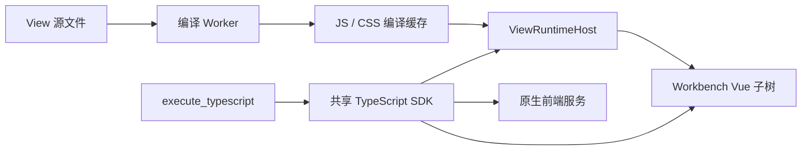

# Locus View 原生运行时

2026-09-07。View 已作为 Workbench 的 Vue 组件子树运行，复用所在窗口的 Vue、Pinia、原生组件、主题与服务。工作台 View 不再创建内容 WebView，也不再执行原生子窗口的坐标同步、重挂父窗口或空闲销毁。

## 运行链路



`WorkbenchViewEditor` 直接渲染 `ViewRuntimeHost`。每个实例绑定 editorId、窗口、checkout、generation 和 materialization epoch；切换焦点不改变已打开 View 的项目归属。共享工作台弹窗按窗口注册控制器，并使用对应的 ownerDocument、样式容器及原生捕获窗口。

新 View 直接使用 Vue 单文件组件作为入口。已有 `createApp(App).use(...).provide(...).mount(...)` 入口通过兼容层保留插件、组件、directive 和 provide 注册，挂载仍由原生 Workbench 完成。`@locus/components` 使用原生组件实现；`pinia` 使用当前应用的实例。

保留 Unity 外部嵌入窗口的薄适配器，它也渲染同一 `ViewRuntimeHost`。这属于 Unity 外部窗口场景；Locus 工作台中的 View 全部使用内置路径。

## 发行后的编辑与热更新

TS / Vue SFC 编译器随应用资源发布，由 Worker 按需加载。Locus 文件编辑器、SDK 写文件和外部修改均可触发包监听。运行时读取完整源码，编译完成后更新已打开的组件，不依赖 Vite、Node 或重新安装 Locus。

- CSS 更新只替换该包的样式，保留现有 DOM。样式选择器限制在 View 根节点；`html`、`body`、`:root` 映射到该根节点。
- 脚本与模板更新替换组件。`useViewState(initial, stableKey)` 保留显式编辑器状态；普通组件局部状态随重建重置。
- 编译失败保留上一个可运行组件并显示错误。运行期错误由组件边界捕获并写入 View 日志。
- 多次快速保存只有最新版本可提交。隐藏标签延迟重新编译，激活时更新。
- 卸载和热替换释放定时器、事件监听、Vue watch/effectScope、SDK 订阅及文件监听租约；异步到达的订阅也会释放。

编译由检查与运行共享：相同请求去重，编译产物使用有界内存缓存与 IndexedDB 持久缓存；Worker 内缓存未变化的模块。缓存键包含应用版本、编译协议、路径、manifest 与源码。Worker 空闲 30 秒后释放，View 编辑状态继续保留。日志以有界批次写入，避免每条 console 都产生一次独立磁盘写入。

## 单一工具入口

### 单文件创建

`locus.views.create({ fileName: "asset-panel.vue", component: source })` 直接创建单个 Vue SFC。组件保存于独立 View 目录，目录根只有该 `.vue` 文件，不生成 `view.json`、`src/main.ts`、独立 CSS 或 workspace scaffold。文件名去掉 `.vue` 即 id 和默认显示名；也可以只传 `id`，由 Locus 生成文件名。

可选的元数据使用文件开头的 `<view>` JSON 自定义块，仅保留 `name`、`icon`、`displayPath`、`unity` 和可选的 `scripts`。格式、API 版本、组件入口等在读取时推导为现有运行时 manifest。列表、重命名、分组移动、日志、存储、ZIP 导入导出和插件复制共用该读取链路；元数据修改写回 Vue 文件，源码保持不变。旧 `view.json` 包继续读取，历史 `template` 字段不再参与校验，也不出现在新 View 或界面中。

创建时省略 `component` 会初始化一个空 Vue 组件；`directories: ["src/components", "unity"]` 按需建立包内目录，不复制示例页面、脚本或样式。模板参数、模板目录和 `view_templates` 命令已移除。`locus.views.components()` 列出现有原生组件，Agent 根据 `skills/view/components.md` 组合控件。画布、图、表格和属性编辑继续复用现有公共组件；原连接面板的交互提取为受控的 `LinkBoard`，通过 props、slots 和 `v-model` 提供数据，持久化由调用方决定。

运行时仍通过同一 Worker 编译组件，`<script setup>`、模板和 `<style scoped>` 均在这个文件中；Agent 后续编辑使用返回的 `manifest.entry` 定位实际文件。内部 `.locus/` 日志与状态按需生成，不作为源码或导出内容。

工具名为 `execute_typescript`，描述明确说明代码在运行中的 Locus 前端执行。它的加载模式为 `Skill`，通过 View Skill 引入，不常驻默认工具列表。旧的 16 个 `view_*` 工具定义和注册已移除；历史会话的工具展示兼容逻辑保留。

```typescript
import { locus } from "@locus/frontend";

const panel = await locus.views.open("asset-editor");
await panel.getByRole("button", "Refresh").click();
await panel.capture();
return { tabs: locus.workbench.tabs(), logs: await panel.logs(20) };
```

`locus.ui` 操作整个 Locus 窗口，`locus.workbench` 操作原生标签页，`locus.views` 管理包及运行实例。View handle 提供快照、定位操作、等待、热重载、日志与截图；文件及 Unity 属性操作复用原生服务。View 包和工具执行使用同一个 SDK 实现与工作区绑定。

工具代码是异步 TypeScript 函数体，可使用 `return`。默认 30 秒，最高 60 秒；截图作为图片附件返回。代码与渲染在前端线程执行，超时可以结束等待并清理托管资源，不能抢占同步死循环。View 是受信任的原生扩展；生命周期代理和 CSS 边界不构成对恶意代码的安全沙箱。

SDK 类型与示例见 `skills/view/frontend-sdk.md`；发行包导出当前运行时与原生组件源码，入口是 `scripts/export-view-runtime-sources.mjs`。支持的模块包括 Vue、Pinia、Locus SDK、包内模块及现有 fs/path 兼容模块；不提供任意 npm 包的运行时安装。

## 验证

使用隔离 profile 和打包后的生产前端资源，以 `http://tauri.localhost/` 运行原生应用，无 Vite 开发服务器：

- 经前端请求通道执行 TypeScript，完成创建包、写源码、打开内置 View、定位原生按钮并点击、等待、读取日志和截图。
- 全新 profile 冷启动时立即执行创建/打开/关闭临时 View，SDK 等待工作台和目标 checkout 就绪后完成操作。
- 打开 View 前后均为 3 个既有页面目标，没有新增 View WebView。
- 保存 CSS 后自动更新，按钮 DOM 对象保持相同；保存模板后自动显示新版本，计数状态仍为 1。
- 同一 View 在主窗口与共享工作台弹窗中分别打开，SDK 对弹窗的点击未改变主窗口中的计数。
- 单元测试覆盖共享 Pinia/provide、旧入口插件注册、JSON 模块、CSS 边界、编译竞态、错误保留、状态恢复、生命周期清理、跨窗口路由及工作区隔离。

实机证据保存在 `.tmp/view-native-migration/acceptance-results.json` 与 `native-view.png`。这里验证的是生产资源与原生协议运行路径，没有把单机采样时延作为性能基准。界面沿用 Workbench 标签/面板结构、BaseButton 与全局主题 token，没有新增装饰卡片、badge 或另一套工具栏。

原生运行时迁移的历史检查结果：`bun run typecheck:test` 通过；相关 Vitest 回归为 54 个文件、255 项测试通过；Rust View/模板测试 47 项通过，工具注册、Skill 加载、schema 和执行策略相关测试通过。生产前端资源构建与原生 custom-protocol 构建通过。

2026-09-09 组件化创建补充验证：Rust View 回归 49 项、相关前端 11 个文件 51 项、类型检查与文档校验通过。隔离开发实例验证了组件发现、空组件及指定目录初始化、旧模板参数拒绝，以及原生 `LinkBoard` 的连接、替换和清空。记录位于 `.tmp/view-component-library-acceptance/result.json`；组件复用 `BaseButton` 和主题 token，数据与持久化由调用方控制。
