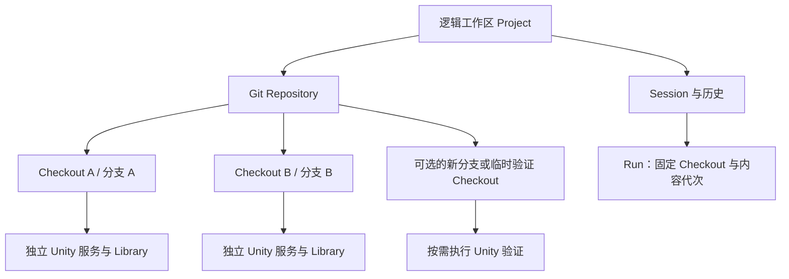

**Locus：多 worktree、Unity 资产解析与合并、项目池及存储优化方案**

调研日期：2026-09-06。调研代码基线：`52e714341f5331e26cdfeff39bcbefc549cf24c7`。本文保留原始设计与决策依据；阶段 1–3 已进入实现与实际 Unity 验收，当前实现范围和测试证据见 [实施与验收记录](./worktree-implementation-and-validation.md)。下文“当前代码”指调研时的基线，性能预算仍是待验证目标。已确认 Windows 优先，保留 macOS/Linux 扩展；首期支持 Unity 6.5，并发量由用户在设置中自行调整。阶段 4 本轮只保留设计。

已纳入补充要求：自研高性能、高准确率的 Unity 资产解析器与合并器，新的 Collab 和 Python SDK 共用新内核。UnityYAMLMerge 不作为产品依赖、执行后端或回退合并器。Agent 参与全部候选改动的选择，能够控制纳入、排除、暂缓及冲突解决；这种控制也覆盖没有冲突的改动。旧代码只作为迁移核对和测试样本来源。

本轮已确认的首期约束：

- Unity 6.5 是支持与验收范围，按工程声明的精确 Editor 版本运行验证和选择缓存；其他 Unity 版本不列入首期支持承诺。
- session、Unity Editor、编译/导入等并发预算可由用户调整，不要求预先确定一个固定并发数。
- Unity YAML 必须支持字段级合并，同时提供对象/组件级、文件级操作 API，统一进入可预览、可验证的合并计划。
- FBX 等二进制/不透明源资产只支持由 Agent 显式选择完整一侧版本，不实现内容级合并；其 `.meta` 仍按 YAML 处理并验证一致性。
- 支持选择其他分支上的多个 commit，将其中选定的修改直接集成到当前脏工作区；目标已有未提交修改不是阻断条件。
- 最终落点由 Agent 选择，可以是两个参与分支中的任一个，也可以是新分支；临时验证目录不限制最终落点。应用到工作区、暂存和提交是独立操作。

**1. 建议路线与核心结论**

保留原定四个阶段，将第二阶段细分为“资产内核”和“合并工作流”：

1. 完成 Locus 内 worktree 的创建、发现、管理和 session 绑定，沿用已经存在的 Project/Checkout 分层。
2. 先建设自研 Unity 资产解析、索引、差异及合并内核，再让 Collab、Python SDK 和 Agent 使用它。固定所选 commit 及目标工作状态，生成可选择的语义变更目录；Agent 制定计划，并选择写入已有分支/worktree 或新分支，允许目标为脏工作区。
3. 复用固定路径的 Unity 项目槽位，切换源码 commit，保留兼容的导入缓存。把目录复用与 Editor 进程复用分别管理。
4. 增加存储 provider：普通复制作为通用基线，ReFS block clone 作为 Windows 首选 CoW 实现，其他平台后续接入。

需要在第一阶段就定义租约、持久化归属和 checkout 内容代次，否则第三阶段复用目录时，旧 session 可能错误地接到新任务。项目池的实际实现可以按原顺序推进。

最重的工作是第二阶段的资产语义与验证体系。Git worktree 解决目录隔离；Unity 语义合并解决正确性；项目池减少反复准备成本；CoW 降低已复制内容的额外磁盘占用。它们需要独立的验收标准。

**2. 当前代码已经具备什么，仍缺什么**

| 范围 | 已核对的实现 | 对方案的影响 |
| --- | --- | --- |
| 逻辑项目与物理目录 | [identity.rs](../../src-tauri/src/workspace_service/identity.rs#L159) 已有 ProjectId、CheckoutId，能识别 `.git` 文件及 common dir；CheckoutId 从规范化目录生成 | 保留身份体系，补受管 worktree 生命周期及内容代次 |
| 同项目资源 | [project_resources.rs](../../src-tauri/src/workspace_service/project_resources.rs#L143) 已有 ProjectCollaborationHub；知识目录也有跨 checkout 投影 | 逻辑项目聚合可复用，历史资产解析不能使用“最新工作区投影” |
| 执行路由 | [execution.rs](../../src-tauri/src/workspace_service/execution.rs#L12) 为每个 Agent run 固定 checkout、generation、服务绑定，并持有租约 | session 切换、面板切换不能改变正在运行的工具目标 |
| 会话持久化 | [models.rs](../../src-tauri/src/session/models.rs#L131) 已有 checkout 记录、默认 checkout、run 的 branch/head/service 快照；[store.rs](../../src-tauri/src/session/store.rs#L899) 当前 schema 为 v44 | 扩展现有表与显式迁移，保留历史导出 |
| Git 隔离 | [commands/git.rs](../../src-tauri/src/commands/git.rs#L36) 区分 repository 锁、checkout 文件锁和缓存命名空间 | 继续审计共享 refs、Git 子进程、撤销及跨进程操作 |
| 多 Unity 服务 | [unity.rs](../../src-tauri/src/workspace_service/unity.rs#L125) 按 checkout 创建服务；[runtime.rs](../../src-tauri/src/workspace_service/runtime.rs#L155) 按 checkout 保存 watcher、AssetDb、预览缓存 | 已有较好的隔离基础；服务停止不等于 Unity.exe 退出 |
| 资源预算 | [resource_policy.rs](../../src-tauri/src/resource_policy.rs#L36) 已管理服务、watcher、LSP、编译并发和闲置回收 | 扩展磁盘槽位、真实 Editor 进程和克隆/导入并发预算 |
| 工作台 | [DevelopmentWorkbench.vue](../../src/components/workbench/DevelopmentWorkbench.vue#L7712) 已显示同项目 checkout 列表；[workspaceContext.ts](../../src/stores/workspaceContext.ts#L37) 已按 pane 保存焦点 | 沿用工作区树、标准列表、轻量选择器和 Collab 面板 |
| Python | [_client.py](../../python/locus/_client.py#L165) 的工具调用已接受 WorkspaceRef；[sdk.rs](../../src-tauri/src/sdk.rs#L2455) 解析显式 checkout | 底层已可路由到指定 checkout，缺少合并事务与快照资产 API |
| 旧结构合并 | [session.rs](../../src-tauri/src/merge/session.rs#L110)、[three_way.rs](../../src-tauri/src/merge/three_way.rs#L25)、[patch.rs](../../src-tauri/src/merge/patch.rs#L801) 已有字段比较与部分程序化写回 | 可保留 UI 交互经验和回归案例，核心数据模型重新设计 |

扫描现有 commands、services 和工作台入口，未发现完整的创建/删除 Git linked worktree 管理 API。已有“显示/打开 checkout”的能力不等于已完成第一阶段。

还需重点审计两个现有边界：

- ProjectIdResolver 优先取 `Locus/config.json`，其次 Unity product/project GUID，再其次 Git common dir。自动创建 worktree 时必须继承已确认的逻辑项目归属，不能让新目录重新推导出不同 ProjectId；也不能仅因两个独立项目复制了同一个 GUID 就自动赋予跨项目写权限。
- [git_merge.rs](../../src-tauri/src/vcs/git_merge.rs#L10) 仍有单名的 `refs/locus/stash-apply-abort`。Git 的多数 `refs/*` 是仓库共享的，需审计并改为 checkout/operation 作用域。这里是静态检查发现的并发风险，本次没有复现损坏。

**3. 第一阶段：管理 worktree，并把 session 放在正确目录中**

建议保留四层归属：



逻辑工作区保留会话和项目级设置；checkout 拥有 HEAD、index、源码目录、运行态索引和 Unity 服务。一个 session 可以在不同轮次显式转到同项目的其他 checkout，但一个运行中的 run 只有一个固定执行目标。

Git linked worktree 共享对象库和多数 refs，各自拥有 HEAD/index。默认不允许同一个本地分支被两个 worktree 同时检出；`git worktree lock` 防止 prune/move/remove，并不是写操作互斥锁。[Git worktree 官方说明](https://git-scm.com/docs/git-worktree)

首期入口建议：

| 入口 | 行为 |
| --- | --- |
| 创建 worktree | 选择起点 commit/分支，创建新分支及目录；从当前 commit 开始与包含未提交修改是两个明确选项 |
| 导入已有 worktree | 通过 Git 列表发现目录，核对 repository 和 Unity 子目录，再注册到逻辑项目 |
| 在 worktree 中新建 session | 写入默认绑定；随后每轮固定执行快照 |
| session 更换 worktree | 空闲时更新默认绑定；运行中仅对后续轮次生效，历史路径与 commit 保持原记录 |
| 查看/清理 | 显示分支、路径、dirty、关联 session、运行状态；区分移出列表、释放受管槽位、删除物理目录 |

目录默认放到项目源码目录外的可配置池根下，避免 Unity 导入、仓库扫描和 watcher 把兄弟项目当成当前项目内容。若 Unity 工程位于 Git 仓库子目录，持久化 `repo_root` 和 `project_relative_path`，worktree 创建的是整个 Git checkout，Unity 打开的是其中的工程子目录。

新增元数据建议作为现有 checkout 记录的扩展或伴随表：`managed/external`、`repository_id`、Git worktree 标识、工程相对目录、期望分支、创建起点、生命周期、关联任务、最近错误。路径移动先不作为 MVP 主入口：当前 CheckoutId 与路径关联，移动还牵涉恢复记录、Unity 缓存及 Git repair。

为后续池化补充 `materialization_epoch`：同一物理目录从任务 A 切到任务 B，或整体替换内容时递增。它与 runtime generation 不同，后者描述进程内 runtime 的重建。工具句柄、异步结果、预览、run 和池租约至少绑定 checkout、epoch、必要的服务 generation。

运行前验证顺序：session/project 归属 → worktree 注册与路径 → assignment/epoch → 服务 readiness。原 session 的工作分支与快照必须独立保留，不能只保存一个未来可能被回收的目录地址。

写协调要覆盖 Git、Agent 文件工具、Python 嵌套 SDK、Unity、watcher 投影及 LSP。优先短时间获取所需 checkout 锁，并以统一顺序获取多个资源；仓库 ref 更新只在提交阶段短暂持锁。不得持有仓库全局锁等待模型判断、Unity 启动或用户操作。多个 Locus 进程之间还需要 OS/文件级 lease 及 Git 自身的 ref/index 锁，进程内 Mutex 不能包办。

删除/回收前确认不存在运行任务、打开文件的未保存内容、Unity 未保存场景、编译、导入、Play Mode、未完成 merge/rebase、未知未跟踪文件及外部持有者。受管临时目录才能自动回收；外部 worktree 保留用户所有权。创建和删除采用持久 operation journal，启动后用 Git 实际状态对账，处理中途取消和应用崩溃。

Git LFS、submodule、外部符号链接以及 `Packages/manifest.json` 的本地 `file:` 依赖必须在创建前识别。LFS pointer 不能当作真正资产解析；外部可写目录不能悄悄由两个 checkout 共享。首期建议常规 Git + LFS 优先，submodule/外部可写依赖作为显式兼容能力逐项支持。

前端沿用现有项目树、checkout 行、Chat session 列表和 Collab 分栏。分支/工作路径属于执行目标信息，放入现有轻量选择器；磁盘预算与缓存策略放设置或详情，不在输入区增加常驻说明或新胶囊样式。

**4. 第二阶段 A：重新建设 Unity 资产内核**

旧实现需要重做的依据：

| 代码观察 | 新内核要求 |
| --- | --- |
| `parse_yaml_docs` 返回文档向量，没有完整解析诊断；旧 session 主要用“非空内容是否解析出至少一个文档”判断成功 | 每个字节区间、文档和语义覆盖范围都可追踪；部分成功不得升级为可自动合并 |
| `YamlDoc` 提取选定语义字段；`UnityYamlDocs` 仍持有逐行 `Vec<String>`；patch 阶段重新解析字段 | 原始字节及 span 索引为事实来源，结构信息按需构建，减少多轮扫描和字符串分配 |
| `build_merge_session` 的 OID 参数目前未用于内容读取，实际从当前 Git index 的 1/2/3 stage 取数据 | 输入必须是已经固定的内容及完整树快照，key 与实际输入一致 |
| [inspector.rs](../../src-tauri/src/merge/inspector.rs#L69) 为三方都配置当前 Workspace AssetDb 的 GUID resolver | 建立各个 Git tree 独立的 GUID、路径、脚本、prefab 依赖索引 |
| `auto_merge_field` 用 `unwrap_or("")` 参与比较 | 字段缺失、空字符串、null、零值分别表达，不能在比较前折叠 |
| 旧 patch 明确拒绝一些混合结构修改，旧 inspector 隐藏了一部分字段 | 合并引擎覆盖完整原始结构；字段隐藏、标签和分组只影响展示 |
| 写回围绕逐行拼接和部分 prefab 规则 | 建立受验证的结构操作与最小范围写回，保留未理解字段及原始数据 |

以上为静态证据，不是本次完成的性能基准或所有问题的失败复现。

建议新增纯 Rust 的 `unity_asset_core` 模块/内部 crate，通过现有后端服务暴露给 UI 与 Python。核心输入为字节和显式依赖快照，不依赖 Tauri、当前面板、活动 Editor 或 Python 对象图。

建议分五层：

| 层 | 数据与职责 |
| --- | --- |
| 内容层 | 不可变 BlobSource：Git blob、工作目录冻结快照、测试语料；记录大小、hash、来源 |
| 语法层 | 支持 Unity 方言的词法/语法树，保留字节区间、文档头、tag、anchor、序列、map、scalar、格式与未识别部分 |
| 资产层 | 对象、组件、层级、PPtr 引用、prefab 实例/override、managed reference、importer/meta 的语义视图 |
| 快照层 | 每个 tree 的 GUID→路径/资产、脚本 schema、prefab 来源图及外部依赖闭包 |
| 差异/合并层 | typed delta、三方规则、冲突及原因、解决操作、写回计划、静态验证结果 |

解析器与合并器的实现归属已经确定，按以下分工实施：

| 部分 | 实现约束 |
| --- | --- |
| Rust 自研语法层 | 自建 Unity 方言 tokenizer/parser，保留原始字节/span、诊断和未知结构；通过真实语料、fuzz、性质测试和 Unity 验证建立准确率 |
| Rust 自研资产/差异/合并层 | 自建对象身份、引用图、typed delta、依赖关系和三方规则；结果可解释、可选择、可复现 |
| 通用语法工具 | 如用于离线语料交叉检查，只作为辅助测试设施；不成为产品解析器或合并器的回退路径 |
| Python | 只做客户端、Agent 编排和 typed transformation；解析与写回统一由 Rust 核心完成 |

Unity 官方明确其 UnityYAML 只支持 YAML 的一部分，并未提供面向外部任意改写的稳定格式契约；自研范围是经过验证的 Unity 方言及其资产语义，需要维护版本兼容语料和写回验证。[UnityYAML 官方说明](https://docs.unity3d.com/6000.0/Documentation/Manual/UnityYAML.html)

对象和引用的身份建议：

- 资产：所在 repository/tree + `.meta` GUID，路径是可变化属性；内置资源和无普通 `.meta` 的来源单独建模。
- 文本资产内对象：asset identity + fileID；fileID 跨资产不能直接等同。基线不存在、两边各自新建的同 fileID 对象也不能直接视作同一对象。
- prefab：保留本地实例 ID、source GUID/fileID、stripped 对象以及 override 的目标路径，不能把实例修改错误地应用到源 prefab。
- managed reference：以宿主对象及其本地 rid 为范围，保留类型的 namespace/class/assembly 信息；跨宿主不能按 rid 配对。
- 未确定类型的 scalar 保留原始表达。数值、bool、enum、对象引用在 schema 允许时才规范化；fileID 等 64 位整数经 JavaScript/JSON 传输时使用字符串，避免精度丢失。
- 同名 GameObject、相同组件类型和层级路径可辅助展示，不能作为唯一自动匹配依据。

首批语料应覆盖 `.unity/.prefab/.asset/.mat/.anim/.controller/.overrideController/.meta` 及 ProjectSettings 中的文本资产；实际按文件内容识别，不只按后缀。文本可读、语义已知、可自动合并是三个不同能力。Terrain、模型、贴图及其他源二进制资产不能自动视作可再生缓存。

首期语料由 Unity 6.5 生成并验证。字段级合并与对象/文件级 API 是首期交付要求：对象增删、完整对象选边、字段修改、文件选边/移动/删除均由同一计划层记录依赖和预期状态。FBX 等格式作为不透明文件保存，即使存在文本编码变体也不转入 Unity YAML 合并器。它们的内容只做完整版本选择，不开发通用二进制语义解析/合并路径。

新内核保留未知 classID、未知字段、缺失类型以及原始字节，返回结构化诊断。支持解析但不支持语义合并的区域，整体选边或进入专门的迁移操作；自动流程不要求模型改 YAML。

性能设计重点：

1. 对不可变 blob 做一次顺序扫描，建立行/文档/span 索引，按需解码 scalar；活文件先获取一致字节快照，避免直接长期 mmap 正在被 Unity 改写的文件。
2. 以内容 hash + parser 版本缓存语法结果，多个 checkout 中相同内容只解析一次。引用/schema 结果另以 tree、编译定义、包依赖及语义版本作为 key。
3. 以 `git cat-file --batch` 批量取 blob；对已变化文档或资产增量重算。普通文件监听只提供失效线索，不能替代内容一致性验证。
4. 使用现有 Rayon 思路做受资源预算约束的并行，优化重复工作和分配才是关键；现有实现已经并行解析三方，不能把新增线程数当作主要收益。
5. 摘要、目录、冲突列表先返回；Inspector、字段和引用分页加载。Python 拿句柄、游标和选定字段，避免把三个完整大场景转成巨大 JSON。
6. 按字节限制缓存、支持取消、设置解析深度/节点/文件大小预算。未知或超预算内容可检查但禁止自动写回。

建议阶段 0 建立旧版本基线，记录纯解析、GUID/schema 解析、三方匹配、首屏、完整写回分别的 P50/P95、峰值 RSS、分配量及缓存命中率。初步目标是代表性大资产端到端 P95 至少改善 2 倍、峰值内存降至旧路径的 50%–60%；这些是待定标的工程目标，本次没有测得这些收益。

正确性关卡优先于速度：未修改输入应能逐字节保留；局部修改只改变计划中的字节区间；未知字段无丢失；无新增悬空引用/重复 GUID 或 ID；支持集合内的自动误合并在验收语料中必须为零。另行报告语义覆盖率与自动解决率，不能靠把所有输入标成“不支持”获得虚假的高准确率。最终还需 Unity 导入与语义往返验证。

**5. 第二阶段 B：由 Agent 将多个 commit 的选定修改集成到指定工作区**

一个 Unity Editor 的 AssetDatabase 和已编译程序集服务于它打开的项目。给 `unity_execute` 增加第二个目录参数，并不能让同一 AppDomain 同时可靠地使用两个分支的同名类型、各自的 importer 和 GUID 数据库。Unity 的资产 API 本身也围绕当前项目资产路径工作。[AssetDatabase.LoadAssetAtPath](https://docs.unity3d.com/6000.0/Documentation/ScriptReference/AssetDatabase.LoadAssetAtPath.html)

因此建议让 Python SDK 编排 Locus 后端的合并任务。`unity_execute` 继续执行某个明确 checkout 的 Unity 操作；如确实需要观察另一版本，由后端获取那个 checkout 的租约并连接其 Editor。跨目录数据传输使用带快照身份的结构化数据，不能直接传递另一个 Editor 的 UnityEngine.Object。

合并输入、最终落点与临时验证目录分别建模。Agent 可以选择参与合并的任一分支/worktree，包括当前脏工作区，也可以创建新分支；后端按需要使用临时目录验证候选内容，不强制将最终结果放到独立 integration 分支。

默认合并流程：

| 步骤 | 输入/动作 | 关键约束 |
| --- | --- | --- |
| 固定来源与落点 | 将所选分支、多个 commit/范围及 Agent 选择的落点解析为稳定身份；记录各 commit 的父版本、顺序、tree、Unity 版本、包和工程目录 | 指定 commit 列表不等于合入整个分支；未选择的中间 commit 不得悄悄纳入 |
| 捕获目标工作状态 | 目标是 checkout 时，自动保存其 HEAD、index、已修改/删除文件及相关未跟踪文件的完整工作状态快照 | dirty 是正常输入，不要求先提交或 stash；保留暂存与未暂存边界；Unity 内未保存内容单独识别，不能冒充已捕获的磁盘数据 |
| 准备合并任务 | 持久化 MergeJob、来源序列、目标快照和落点；构建内存/磁盘候选树，按需租借验证目录 | 输入固定后只针对该快照规划；最终写入时再核对目标，避免覆盖规划期间的新修改 |
| 生成候选目录 | 借助 Git 发现文件/目录 rename、增删和普通代码差异；自研内核解析全部相关 Unity 语义变化 | 这里只提出候选，不自动接受任何 source 改动；不能只列 Git 已报冲突的文件 |
| Agent 制定选择 | 按 commit、文件、资产、对象、组件、字段或操作组纳入/排除/暂缓，可批量选择整个明确范围；二进制明确选边 | 选择也覆盖无冲突改动；以 target 的真实工作状态为基底，只叠加选中的来源操作 |
| 检查依赖闭包 | 返回选中改动所需的脚本、meta、对象、引用和 prefab 结构依赖 | 不静默扩大选择范围；Agent 决定补选依赖、换一种实现或撤回相关操作 |
| 代码与 schema | 基于所选代码/包/设置变更与目标本地修改构建候选代码；为各来源 commit/父基线及 target/result 建立 schema | 未选代码保持 target 工作状态；保留 script GUID；类型缺失、引用不全和条件编译不确定要记录，不能借用当前 Editor 的旧类型替代 |
| 资产合并 | 自研规则仅在选定操作范围内处理三方值、序列、引用和迁移，构建结果计划 | 使用各自快照的 GUID 和 prefab 图；隐藏字段参与完整性判断但不能成为偷偷纳入的新改动 |
| 冲突决策与预览 | 向 Agent 或 Collab 返回冲突、依赖、每次选择的后果、最终变更集及未纳入项 | 使用取某侧、设置 typed value、显式迁移等 API；Agent 可继续调整计划，避免手工拼写 YAML |
| 静态验证 | 验证语法、ID、引用、prefab 图、字段覆盖、schema 和操作前提 | 不可证明完整性的区域保留为待处理状态 |
| Unity 验证 | 在按需取得的验证目录或有明确恢复能力的最终 checkout 中验证一致候选内容，使用 Unity 6.5 对应精确版本 | 实际 Editor 状态满足导入/编译屏障后执行；不把冲突标记或半成品资产交给 Editor |
| 写入选定落点 | 核对目标 HEAD、index、工作文件、未跟踪路径、epoch 与租约，按计划应用；记录选择清单、验证与恢复数据 | 已有 dirty 本身不报错；规划后变化返回 stale/replan；默认在既有目标上保持 HEAD/index，不自动提交 |
| 可选暂存/提交 | 由 Agent 另行指定暂存范围与提交范围，形成可审查 diff 和 commit | 不自动夹带原有未提交修改；部分集成使用单父 commit + manifest，完整历史集成才可采用两父 merge |

现代 `git merge-tree --write-tree` 可以生成树及结构化冲突信息，不需要改动已有 index 或工作目录，可辅助 Git 文件层预分析。它不是自研 Unity 合并器，也不是选择性合并的最终结果生成器：最终树应从 target 出发，仅应用 Agent 选定并验证的操作。此命令会写对象库，仍须处理退出码、目录冲突和多个共同祖先；资产内核若使用虚拟 base，需要显式记录并使用同一基线。[Git merge-tree](https://git-scm.com/docs/git-merge-tree)

整个工作流还应明确 `.gitattributes`、换行、LFS filters 和已有 merge driver 的处理策略，避免同一资产在 Git 与 Locus 两条路径中被不同规则各改一次。首期由合并服务直接编排资产处理；如后续提供 Git merge driver 集成，使用同一内核和可追踪的规则版本，不在创建 worktree 时无提示地覆盖仓库共享 Git 配置。

写入已检出的脏目标时，应取得该 checkout 的独占写租约并满足 Unity 编辑/导入屏障，应用经过验证的文件级 patch 计划；不能用 fast-forward、reset 或整树 checkout 替代此流程而覆盖原有修改。若 Agent 选择完整提交结果的方式更新干净目标或未检出的 ref，可采用对应的 Git 更新路径，并核对旧 OID。Git 的 compare-and-swap 只能保护 ref，Git ref、index、SQLite 和多文件写入仍需要 journal、内容前置条件与失败恢复。[Git update-ref](https://git-scm.com/docs/git-update-ref)

多个 commit 的输入与组合规则：

- API 接受明确的 commit 列表，也接受可解析为列表的提交范围；准备阶段固定 OID、来源分支、顺序和父版本。连续范围与非连续选取都属于首期支持范围。
- 候选目录按 commit → 文件 → 对象/字段保留来源，可汇总最终净变化，同时保留修改、撤回和再次修改的来源过程。不能直接使用来源分支 tip 与目标的整分支 diff 冒充所选 commits。
- 每个 commit 的变化以其父版本为输入基线，按显式序列与依赖应用；非连续提交如依赖未选提交，需要 Agent 处理依赖，不能隐式补入。merge commit 必须明确主线父版本或所取的父侧差异，否则返回待补充的选择。
- 来源分支在准备后继续前进不改变本次输入；增加/移除 commit 或改变顺序生成新 plan revision，使旧预览和验证失效。多个来源序列之间同样记录确定的组合顺序。
- 多 commit 会产生多份来源/基线 schema 与 GUID 索引；缓存可共享相同内容，但不能用单一来源 branch HEAD 的 schema 解释全部提交。所选代码及目标已有未提交代码共同决定 result schema。

目标脏状态至少分为三层：`H = HEAD`、`I = index`、`W = 磁盘工作树及纳入范围的未跟踪文件`。开始时保存 H、完整索引记录及相关文件内容、文件模式、存在性与路径清单；不只记录 `git diff` 文本。以 W 构建候选结果，并把来源修改与 H→I、I→W 的本地修改分别标注来源。未跟踪文件与来源新增文件重名也必须进入冲突检测；忽略的缓存不自动纳入源码快照，计划外路径保持不变。

默认 `plan.apply()` 在已有目标目录写入 W′，保持 H 和 I 不变，使新合入的内容继续处于未提交状态；原有暂存/未暂存边界保留。目标原有修改与来源修改发生重叠时，Agent 通过同一语义计划明确取舍；“保留脏状态”不意味着禁止经明确选择后修改该字段。写入前核对目标仍匹配计划快照；规划后出现的新修改进入 stale/replan，不能误当成可覆盖的旧 dirty。

失败恢复恢复本次触及文件的原内容/存在性，并保留原有 index。恢复也需核对文件是否仍为本任务写入的版本：若已有其他进程后续写入，保留快照并返回需要重新协调的状态，不能用整树 reset 覆盖。应用成功后的撤销采用同样的有条件恢复。磁盘中的未提交内容与 Unity 内未保存场景/文件编辑器 buffer 分别检查；涉及的未保存内容需要保存、明确采用磁盘版本或进入相应冲突处理。

最终落点协议：

| 落点 | 语义 |
| --- | --- |
| 参与分支 A 的已有 checkout | 以 A 当前工作状态为目标快照，可以是脏工作区；应用所选来源改动 |
| 参与分支 B 的已有 checkout | 以 B 当前工作状态重新建立目标快照、方向和来源计划；不能复用 A 方向的预览直接写 B |
| 新分支，位于当前 checkout | 按 Agent 选择的基底创建/切换分支，保留该 checkout 的本地修改并应用结果；提交是另一步 |
| 新分支，位于新 worktree | 固定 Agent 选择的基底分支/commit 或工作状态快照，将其本地修改在新目录实体化后应用结果；原目录保持原状 |

新分支如包含脏快照，要分别重建所选基底的 index 与工作树层，不要求先把本地改动做成用户分支上的 commit。Git 内部保留快照用的对象/ref 与用户可见提交分开。对于已经在其他 worktree 检出的分支，使用它实际所在的 checkout 执行，不能绕过 Git 分支占用保护。临时验证工作区只承载检查，不替 Agent 决定上述落点。

暂存与提交必须独立指定范围。提交时基于 HEAD 另行构建并验证提交树；如果所选来源修改依赖原有未提交改动，返回依赖问题，由 Agent 决定一并纳入还是暂不提交。不能把整个 W′ 快照直接提交并夹带用户已有修改。

脚本与序列化数据同时变化，是第二阶段的独立核心需求。例如：

```text
base:  C# 字段 health；场景 health = 100
ours:  字段改为 hitPoints，并声明 FormerlySerializedAs("health")
theirs: 场景 health 改为 120

期望：在最终代码的 schema 下保留值 120；不丢失旧值，不产生两套字段。
```

推荐做法是从每侧源代码/程序集元数据提取 schema，将可靠的字段别名映射到最终字段，再比较值。Unity 的 `FormerlySerializedAs` 支持字段改名时保留序列化值，但无法推导任意字段拆分、类型转换或业务含义变化。[FormerlySerializedAs](https://docs.unity3d.com/6000.0/Documentation/ScriptReference/Serialization.FormerlySerializedAsAttribute.html)

| 变化 | 处理策略 |
| --- | --- |
| 有明确 FormerlySerializedAs 的字段改名 | 在无歧义、类型兼容且 prefab override 路径可映射时自动迁移；否则返回冲突 |
| 无属性的改名、两侧各改成不同名字 | 提示候选对应关系，要求显式映射；名称相近不足以自动确认 |
| 类型改变、字段拆分/合并 | 使用可审查的 typed transform；保留原始输入与转换结果；必须验证数值范围、空值和引用 |
| 脚本/类型/程序集移动 | 跟踪 `.meta`、asmdef、类型身份及相关迁移属性；不能只看 C# 文件名 |
| SerializeReference | 保留宿主范围 rid、共享/循环关系和 namespace/class/assembly；类型缺失单独报告，不将 null 当成用户删除 |
| UnityEvent/AnimationEvent | 检查目标类型、方法及签名是否仍存在，不能只检查 YAML 引用格式 |
| 自定义 importer/ISerializationCallbackReceiver/第三方序列化 | 作为插件化规则或项目迁移；静态引擎无法保证任意回调的行为，进入对应版本 Editor 验证 |

Unity 对缺失的 managed-reference 类型有专门行为与检测 API，其原始序列化数据可能仍然保留；不能看到运行时 null 就清除磁盘数据。[SerializeReference](https://docs.unity3d.com/6000.0/Documentation/ScriptReference/SerializeReference.html)、[缺失类型检测](https://docs.unity3d.com/kr/6000.0/ScriptReference/SerializationUtility.HasManagedReferencesWithMissingTypes.html)

跨版本 schema 的构建可参考现有 Roslyn/SerializedSchemaSource，但应接收显式源码与编译参数快照。语法分析能在项目暂时编译失败时提供部分信息；它不能把未解析的第三方类型判定为完整 schema。复杂迁移需要源版本 Editor 的只读导出时，分别打开源版本槽位，最后在结果版本中执行转换与验证。

序列和图结构的合并规则需要显式设计：

- 标量：仅一方改变则采用该方；两方改变为同值则可收敛；不同值则冲突；字段删除与修改同样冲突。
- Mapping：按实际键和 schema 合并，检测重复键和未知字段；不给 display label 赋予写权限。
- 对象/引用序列：有稳定元素身份时合并插入、删除、移动；两边的顺序要求冲突则报告。普通值数组含重复元素时不能简单按索引合并。
- 对象树：删除对象与修改其组件、reparent 与修改子节点、对象名重复、两边各自添加相同 ID，均需要图级判定。
- Prefab：按 source GUID/fileID、实例身份和 propertyPath 处理 override，保留源与实例边界；移除组件和修改该组件 override 冲突。
- GUID/fileID/rid 重映射：只有完整影响闭包已掌握时才允许程序化重映射；有外部二进制引用、未知自定义数据或未索引依赖时停止自动映射。
- 二进制/不透明源资产：FBX、模型、贴图和二进制序列化资产在纳入本次集成时，必须由 Agent 指定完整一侧版本；多 commit 存在多个来源版本时同时指定 commit/blob。只做完整内容选择及引用一致性验证，不提供内容合并、拼接或再生成式回退。未纳入的资产保留目标状态。

产品中的 Unity 资产解析、差异、合并和写回全部由自研内核完成。UnityYAMLMerge 不进入执行链路，也不作为失败后的回退。前面开展的离线工具探针只属于调研记录；后续验收以已知期望的语料、自研引擎性质测试和真正的 Unity 加载/序列化结果为依据。

选择性合并是一等能力，Agent 既可以整体选择某个明确范围，也可以逐项检查后决定。默认结果以 target 为基底：排除 source 的一个字段改动，意味着保留 target 对该字段的现状，不是把字段删除或回滚到共同祖先。

建议新内核输出一个稳定的 `ChangeCatalog` 和一个可修订的 `MergePlan`：

| 数据 | 内容 |
| --- | --- |
| Change | change_id、base/target/source 内容身份、资产 GUID/fileID、属性路径、操作类型、旧值/新值、影响对象 |
| SourceSelection | 所选 commit 序列/范围、每项父基线与来源 branch、顺序、主线父版本及依赖 |
| Destination/TargetSnapshot | Agent 选择的已有 checkout 或新分支、基底、HEAD/index/worktree 快照、未跟踪清单、epoch |
| 原子操作组 | 必须一起决定的修改，例如资产 rename 与 `.meta` 移动、添加组件及其 owner 引用、rid 重映射及引用更新 |
| 依赖 | requires/conflicts_with、依赖原因、候选补充方案；包括 C# schema、prefab 来源、引用闭包 |
| Selection | included、excluded、deferred；保留 Agent 的选择来源、范围选择器和例外 |
| Resolution | 取 target/source/base、typed custom value、显式迁移等；每次变更绑定预期原值及内容 hash |
| Preview | 最终路径/对象/字段 diff、未纳入项、未解决依赖、额外副作用、plan_hash |
| Result manifest | 输入快照、计划版本/hash、实际应用与排除项、原因、验证状态、输出 commit、未来仍可集成的来源修改 |

默认不纳入任何 source 操作；Agent 可明确选择“全部 source 改动”再排除指定范围，也可以只选择某些对象或字段。自动三方规则负责计算选定范围中的无歧义结果，不能自行扩大范围。有依赖无法满足时返回结构化问题供 Agent 修订，而不是为了生成合法资产偷偷合入被排除的脚本或资源。

例如 Agent 选择加入一个新组件，却排除定义该组件的 C# 脚本，系统应给出依赖冲突及可选方案；选择移动资产时，资产与 `.meta` 的路径调整作为原子组显示；选择调整 prefab 实例的一个 override 时，不能顺便吸收 source 对 prefab 源文件的所有修改。

首期 API 必须覆盖以下层级，所有修改均进入同一计划、依赖检查与预览：

| 层级 | 拟议操作 API | 约束 |
| --- | --- | --- |
| 文件 | `plan.files.include/exclude/take/delete/move` | 支持文件范围选择与完整版本选边；二进制使用显式 `take`，不执行字段合并 |
| 对象/组件 | `plan.objects.include/exclude/take/add/delete/move` | 使用资产 GUID/fileID/组件身份定位，检查父子、owner、prefab 和引用闭包 |
| 字段 | `plan.fields.take/set/include/exclude` | 使用对象身份与 property path；支持三方选边、typed value 和预期原值；必须实现字段级合并 |
| 计划 | `include/exclude/defer/check_dependencies/preview/validate/apply/stage/commit/abort` | 支持跨多个 commit 选择；apply、stage、commit 分离，dirty 目标可直接 apply |

文件完整选边与内部字段操作重叠时，返回明确的计划冲突或由 Agent 显式展开粗粒度操作，不能靠调用顺序偷偷覆盖字段选择。FBX 内容与 `.meta` 可以分别选择/合并，但 importer 设置、GUID、导入后的子资产 ID 和引用必须一致；不兼容时交回 Agent 处理，不扩展为 FBX 内容合并。

`deferred` 与 `excluded` 采用相同的“本次不应用”执行效果，但报告含义不同：前者留给后续计划，后者明确不接受。重复执行同一个已经成功 apply 或 commit 的 plan 应幂等，不再次添加对象、应用字段变更或生成重复提交；变更选择、解决方案或输入快照后，旧 preview/validation 的 hash 立即失效。Unity 验证如生成计划外资产修改，返回新的副作用 diff 交给 Agent 决定并重新预览，不能沿用原计划的验证通过状态直接提交。

Git 历史必须匹配这个语义。写入脏工作区时默认不创建用户可见 commit；Agent 另行选择提交后，部分集成使用单父 commit，并保存来源 commit 序列、所选 change 与本地修改纳入范围的 manifest。如果把只选择部分内容的结果写成普通两父 merge commit，Git 会认为 source 的祖先历史已经合入，后续合并可能不再提出此前排除的改动。这个风险是从 Git 按父节点确定共同祖先的规则推导出的设计结论。[Git merge-base](https://git-scm.com/docs/git-merge-base) 只有 Agent 明确选择完整分支历史集成时才采用两父 merge。后续“继续集成剩余修改”结合新三方比较与 manifest 生成候选，不只按旧 change_id 盲目跳过，也不能仅凭 `git merge-base` 推断选择历史。

当前选择性合并 SDK 的基本调用顺序如下；完整参数见 [SDK 说明](../../prompt/python-sdk/merges.md)：

```python
# 由一个 Agent 编排；读取和计划修改都绑定不可变输入。
job = await locus.merges.prepare(
    sources=[{"branch_ref": source_branch, "commits": selected_commits}],
    destination={"kind": "checkout", "workspace_ref": workspace_ref},
    target_state="working_tree",  # 包含目标已有 staged/unstaged/相关 untracked
)

changes = await job.changes(include_clean=True, limit=100)
# Agent 检查 changes、相关代码与依赖，得到以下选择集合。
plan = await job.new_plan(default="keep_target")
await plan.include(change_ids=selected_change_ids)
await plan.exclude(change_ids=excluded_change_ids)
await plan.defer(change_ids=deferred_change_ids)

issues = await plan.check_dependencies()
# 若有问题，由 Agent 调整选择或提供结构化解决方案。
for conflict_id, side in chosen_sides.items():
    await plan.resolve(conflict_id, side=side)

for file_path, variant in binary_choices.items():
    # variant 明确 target/source 及必要的 commit/blob；不执行二进制内容合并。
    await plan.files.take(file_path, version=variant)

preview = await plan.preview()
print(preview.files, preview.issues, preview.plan_hash)
# 先静态预览并应用到 W，再在实际目标 Editor 中编译、导入和验证。
if preview.ready_to_apply:
    result = await plan.apply(
        expected_plan_hash=preview.plan_hash,
        index_policy="preserve",
    )
    validation = await plan.validate(level="unity")

# 如需提交部分结果，在独立项目槽位验证 HEAD + 明确选定路径的精确 tree。
# 不把目标目录其他脏代码/资产作为候选提交已经通过验证的依据。
commit_validation = await plan.validate(
    level="unity", paths=selected_paths, include_local_changes=False,
)
await plan.commit(paths=selected_paths, message="Integrate selected changes",
                  include_local_changes=False)
```

底层统一提供 `snapshots.capture/open`、`assets.open/objects/properties/references/diff`、`merges.prepare/changes/new_plan`，以及上述文件/对象/字段与计划 API。新分支落点可用 `destination={"kind": "new_branch", "name": new_branch_name, "base_workspace_ref": workspace_ref, "location": "new_worktree"}` 表达；`location` 也可选择当前 checkout。改变落点必须重新固定目标并生成预览。所有写操作先进入 plan，不能绕过选择清单直接改 asset 句柄。Python 只是薄客户端；用户扩展可返回 typed transformation，后端负责范围验证、写回和日志。离线 Rust CLI 可作为测试与未来 CI 入口，首期不必额外维护 Python 原生绑定打包。

Collab 同步改为显示全部候选语义改动及其选择状态，可按文件/对象/组件分组；用户与 Agent 修改同一份版本化计划。继续沿用现有分栏、树/列表、Inspector 和 BaseCheckbox 的勾选语义。字段取哪侧与该变更是否纳入是两个独立维度，界面和 API 都不能混用。预览展示依赖引起的原子组和实际最终 diff，不用一个“无冲突”状态掩盖未经选择的内容。

跨 checkout API 使用显式来源/目标句柄及短期授权上下文。后台绑定 `project/session/run/job/checkout/epoch`；不能因为传入了任意路径就获得跨工作区修改能力。现有 Python 外层执行锁与 SDK 内层工具锁还需专门处理继承/重入和取消，避免一个脚本持有 A 的锁后等待内部调用再次获取 A 的锁，或 A→B/B→A 循环等待。

新增经过验证的资产修改工具需要同步更新 [unity_safety_constraints.md](../../agent/unity/rule/unity_safety_constraints.md#L1) 和工具路由策略：允许新内核的受控资产操作，继续通过结构 API 修改资产。直接开放通用 `write/edit/python 文件写入` 不是该需求的实现方式。

Unity 验证至少包括：完整编译/域重载、导入完成、缺失脚本、GUID/PPtr 引用、managed reference 缺失类型、prefab overrides、目标场景/资产可加载、关键字段符合预期，以及项目指定的 EditMode/PlayMode 测试。对验证期间产生的额外源码/meta/资产变化单独生成 diff；不能把自动重序列化的副作用悄悄混入结果。Hot Reload 不足以证明序列化 schema 变更正确，应使用真实编译和域重载。Unity 的刷新流程本身包含代码导入、编译和域重载，所以不能假设这些都能在一次 `unity_execute` 中原子完成。[Unity AssetDatabase 刷新流程](https://docs.unity3d.com/6000.0/Documentation/Manual/AssetDatabaseRefreshing.html)

**6. 第三阶段：固定路径的 Unity 项目池**

池化单位建议为“同仓库、同工程目录的一份物理 checkout + 独立 Library + 生命周期记录”。目录长期存在，任务结束时归还租约；下次优先 checkout 新 commit，只有没有可用兼容槽位才创建目录或从冷模板播种。

目录复用不要求 Unity Editor 一直运行。首期建议保留热 Library、关闭空闲 Editor，降低内存与进程状态复杂度；后续再支持同一个内容代次下的暖 Editor 复用。当前 UnityService 的 stop/suspend 主要停止监控、连接、LSP 和 compile scope，未自动保证 Unity.exe 退出，必须增加 Editor ownership 和真实退出确认。

| 层 | 可以复用什么 | 必须独立/失效什么 |
| --- | --- | --- |
| Git Repository | Git 对象库、已下载 LFS 对象 | HEAD、index、merge state、checkout 分支 |
| 物理槽位 | 路径、兼容的 Unity 缓存 | 每次租约、内容 epoch、任务目录、运行态句柄 |
| Unity Library | 让 Unity 校验并复用导入产物 | Editor 版本/目标平台等不兼容时降级；数据库属于各自目录 |
| Locus 缓存 | 按 immutable blob/tree key 的共享结果 | 引用图当前投影、watcher 水位、LSP、预览、Hot Reload 状态、`Library/Locus` 运行标记 |
| Editor 进程 | 只在后续支持、内容和状态已验证时继续使用 | commit/schema 切换默认关闭重开；用户自己打开的 Editor 不可自动强制关闭 |

租借流程：

```text
选槽 → 独占租约 → 验证无活动消费者 → 确认 Editor 已退出
    → 保存/拒绝未提交状态 → checkout 目标 → 更新 epoch 并使旧缓存失效
    → 补齐 LFS/包/插件 → 启动需要的服务 → Unity 导入编译收敛 → Ready
```

归还时将分支或工作快照保存在独立 ref/assignment 中，再把槽位停到 detached 状态，释放分支占用。不得让旧 session 的默认 checkout 在下一次运行时自动指向新的租户：恢复旧 session 时应重新取得槽位并恢复它的期望 ref/快照。

建议把兼容性分为两类：

- 硬边界：repository/Unity 工程相对目录、Unity Editor 精确版本、OS/CPU、构建目标和关键管线环境。不匹配时不原样复用旧 Library，改选其他槽位或重建。
- 软匹配：commit、包锁、importer 代码、程序集/define、导入设置、最近资产修改集。它们会影响缓存收益，但不应一变化就让整个槽位失去复用资格；由 Unity 按依赖重新导入。对于曾发生升级或已知不兼容的包变更，可提升为硬边界。

槽位选择先过滤硬边界，再按预计变化的资产量、包差异、最近成功使用时间和历史启动成本排序。“最近使用”并不必然意味着“最少重新导入”。复用效果需要实测，不能承诺跨 commit 零导入或任意复制 Library 都能直接用。

清理采用受管路径白名单：移除已知的临时文件/运行标记，保留兼容 Library；不使用全目录 `git clean -xfd`。对未知未跟踪内容拒绝自动回收或保存快照。重新使用槽位后主动触发完整一致性核对；不假设 watcher 能从一次大 checkout 的事件流中无损重建全部状态。

Pool 数据至少包含槽位所有权、期望 revision、上次成功 revision、Unity 指纹、epoch、状态、lease owner/heartbeat、磁盘占用估计、上次错误。崩溃槽位进入 quarantined/recovering，由进程与目录事实恢复，不仅依据超时删锁。会话/快照 refs 和仍有引用的池模板必须 pin 住，防止 Git GC 或模板 GC 使恢复能力消失。

Unity 把导入资产、SourceAssetDB 和 ArtifactDB 放在 Library 中；这些是可以从源资产与依赖重建的缓存。推荐优先复用固定路径的完整一致缓存，并让 Unity 验证；跨路径播种仅从已停止 Editor 的一致快照复制，不能在线复制正在变化的数据库。[Unity AssetDatabase](https://docs.unity3d.com/cn/6000.0/Manual/AssetDatabase.html)

预算分开设置：最多活动 session、受管槽位数、活跃 Editor 数、保留的闲置 Library 数、磁盘字节上限、同时启动/导入/复制数。达到预算应排队或回收无租约缓存，而不是继续无限建目录。

并发量由用户在设置中自行调整，包括 session、Editor 和编译/导入等相关预算；配置可持久化并在运行中更新。降低上限先约束新任务的准入和队列，不强行结束已有任务或关闭已占用的 Editor。资源策略提供合理初值和当前使用量，首期不绑定一个必须提前决定的固定并发数。池内 Editor/Library 的兼容性和验收先限定 Unity 6.5，仍以精确 Editor 版本作为缓存匹配条件。

**7. 第四阶段：Windows 的 CoW 与可再生数据策略**

本机实际为 Windows 10 Pro，build 19045；本次查询的可见卷均为 NTFS。当前配置没有可直接使用的 ReFS block clone 路径。Windows 优先的产品需要保留 NTFS 的可用基线，不能把 Dev Drive 当成已有条件。

| 存储路线 | 收益/限制 | 建议 |
| --- | --- | --- |
| NTFS + 有界项目池 + 普通复制 | 普遍可用；复用已有 Library、限制副本数量；每个活跃槽位的不同副本仍独占空间 | 阶段 3 的默认基线 |
| ReFS/Dev Drive + block clone | 同一 ReFS 卷内共享已复制文件的数据块，后续任一侧写入由文件系统隔离 | Windows CoW 首选 provider；按实际 OS/卷/调用结果检测 |
| NTFS 上新建 ReFS VHDX 容器 | 在支持的 Windows 环境中提供统一池卷，种子与槽位在同一卷；引入挂载、权限、容量和恢复管理 | 可选部署形式，不自动改造用户现有盘 |
| 保持 NTFS 的 differencing VHDX | 父镜像只读、子盘保存差异；可研究 Windows 10 下的磁盘层方案 | 独立 PoC，工程量较大，首期不默认：挂载权限、磁盘身份冲突、路径、层增长、压缩回收和崩溃恢复均要验证 |
| 文件 hardlink / 目录 junction | 指向同一可写文件或目录，Unity 的写入可能影响兄弟项目 | 不用于共享可写源码、Library 或数据库 |
| 自建文件系统/filter driver | 有机会控制任意写入与分层存储，但安装、签名、兼容性和故障面很大 | 当前阶段不采用 |

ReFS 的 block cloning 具有真正的写隔离；要求源/目标位于同一 ReFS 卷，还存在簇对齐、单次范围大小和文件属性限制。实现应通过文件系统能力检测和一次受控探针选择 provider，处理大文件分段与尾部，再回退到普通复制。[ReFS block cloning](https://learn.microsoft.com/en-us/windows-server/storage/refs/block-cloning)、[Win32 block cloning](https://learn.microsoft.com/en-us/windows/win32/fileio/block-cloning)

微软不同页面对“普通复制自动触发 block clone”的开始版本描述有所差别，因此不应仅凭版本号假设 `CopyFile` 一定节省空间。使用显式能力探针及实际结果更可靠。Dev Drive 本身要求受支持的 Windows 11 环境和管理员设置；它支持新建 VHDX，不能把现有普通卷无损转换为 Dev Drive。[Dev Drive 要求](https://learn.microsoft.com/en-us/windows/dev-drive/)

Windows Virtual Disk API 支持指定父磁盘，但附加虚拟磁盘需要对应管理权限。这只能证明该技术路线值得做 PoC，不能证明多份 Unity 工程在差分子盘上的稳定性。[CreateVirtualDisk 参数](https://learn.microsoft.com/en-us/windows/win32/api/virtdisk/ns-virtdisk-create_virtual_disk_parameters)、[AttachVirtualDisk](https://learn.microsoft.com/en-us/windows/win32/api/virtdisk/nf-virtdisk-attachvirtualdisk)

hardlink 不是 CoW：即使 Locus 自己写文件前断开链接，Unity、Git、编译器或其他程序仍可能直接写原文件；文件 watcher 在写后通知，无法充当通用写前屏障。只允许 Locus 全程控制并且严格不可变的内容库采用共享策略，可写工作区通过 clone/copy 实体化。[Windows hard links](https://learn.microsoft.com/en-us/windows/win32/fileio/hard-links-and-junctions)

建议引入小型内部接口 `MaterializationProvider`，负责 `capabilities / seed / clone_file / populate / measure / release`。项目池控制生命周期和租约，provider 负责具体存储方式，避免把 ReFS 判断散在 Git、SDK、Unity 模块中。将来 macOS 用 APFS clone，Linux 对支持的文件系统接 reflink，其他情况回退 copy。[Apple cloning API](https://developer.apple.com/library/archive/documentation/FileManagement/Conceptual/APFS_Guide/ToolsandAPIs/ToolsandAPIs.html)、[Linux Btrfs](https://docs.kernel.org/filesystems/btrfs.html)

按文件性质制定策略：

| 数据 | 策略 |
| --- | --- |
| Assets、ProjectSettings、Packages 中的源码和源资产 | 各 checkout 独立，可经真正 CoW 实体化；必须纳入版本/快照与资产语义判断 |
| Git objects / LFS 对象 | 复用同仓库对象库，维护工作快照保留 ref；不能把 LFS pointer 的小体积当成资产已可用 |
| Unity Library 的导入产物、Shader/Bee 等缓存 | 固定路径优先复用；模板播种时从静止、一致的种子执行 clone/copy，由 Unity 验证并更新 |
| SourceAssetDB / ArtifactDB | 每个槽位各自拥有文件；允许从离线一致模板 CoW 克隆，禁止共享同一个可写数据库实例 |
| Temp、Logs、obj、运行锁、`Library/Locus` 的进程/连接标记 | 按实际用途独立生成或重建；不盲目复制 PID、连接状态、watcher 水位、旧绝对路径和运行中数据库 |
| Unity 全局 UPM cache | 优先沿用 Unity 自己的全局缓存；checkout 的包解析结果与 embedded/local 可写包仍需隔离 |
| 自定义生成资产 | 只有明确记录生成配方、输入 hash、工具版本且可复现，才能按可再生对象回收；否则按源资产保留 |

Unity Package Manager 已有全局缓存，可减少重复下载；应利用官方机制而不是让多个可写 `Library/PackageCache` 指向同一目录。[UPM global cache](https://docs.unity3d.com/6000.0/Documentation/Manual/upm-cache.html)

Unity Accelerator 可选地降低重复导入计算和等待时间，但各项目依然保有本地导入数据，不能把 Accelerator 等同于本地磁盘 CoW/去重。它也可能额外占用服务器/本地缓存空间，收益应分别测量。[Unity caching assets](https://docs.unity3d.com/cn/6000.0/Manual/importing-caching-assets.html)

还需要区分“克隆”和“后来生成的数据去重”：CoW 只对从共同种子克隆出的块产生共享；两个 Editor 各自重新生成的相同二进制，不会因此自动去重。后续可把经过验证且不可变的导入快照提升为新种子，再克隆给其他槽位；对已运行项目的后台硬链接去重不应采用。

种子生命周期建议为：创建临时目录 → 初始化/导入完成 → 关闭 Editor → 清理运行标记 → 校验一致性 → 发布不可变 manifest → 才可供新槽位克隆。更新种子创建新版本，已有子项继续引用旧版。固定挂载路径并记录 volume identity，卷离线时进入 unavailable，不重新创建一个同名空目录冒充原槽位。

磁盘预算同时考虑正在克隆的临时占用、写时分离后的增长和剩余空间；不能只看创建瞬间占用。指标记录逻辑字节、实际复制字节、克隆字节、回退原因和共享占用估计。多个文件逻辑大小相加不等于真实物理占用，受控实验以卷空间差值等手段核验，并说明其他进程写入的干扰。

**8. 实施顺序、交付边界和验证关卡**

| 阶段 | 可交付结果 | 主要文件/模块 | 必须通过的关卡 |
| --- | --- | --- | --- |
| 0：基线与契约 | Unity 6.5 语料库、旧路径 profile、Git/文件系统能力矩阵；固定身份、脏状态快照、commit 序列、可选落点与租约协议 | tests/fixtures、新 benchmark harness、identity/session/runtime 契约 | 有已知期望的三方/多 commit 样例；大小/复杂度分桶；Unity 6.5 精确版本记录 |
| 1：worktree 管理 | 创建、导入、列表、session 选择、关闭/释放、恢复 | 新 worktree manager、workspace_service、session/store、project service、workbench | A/B 同路径不同内容同时编辑/编译不串；切 pane 不改目标；dirty/崩溃不丢数据 |
| 2A-1：新资产读取 | lossless 解析、快照 GUID/schema 索引、结构化查询 | 新 unity_asset_core、资产读取/索引适配器 | 完整诊断、未知字段保留、回归/fuzz、Unity 比对、性能基线达标 |
| 2A-2：新 diff/冲突 | 同一内核供 Collab、资产预览和 SDK 查询；提供字段/对象/文件级 API | 新 delta/merge model、Collab adapter、分页服务 | 字段合并、对象匹配、引用、增删移动、数组/prefab 语料；二进制只选边；不受 UI 隐藏字段影响 |
| 2B：Agent 选择性合并 | 多 commit 候选目录、纳入/排除/暂缓、依赖闭包、任一参与分支或新分支落点、脏工作区 apply、独立 stage/commit、Unity 6.5 验证 | merge plan/orchestrator、sdk.rs、Python models/client、Collab 计划交互、Unity 验证能力 | 已有修改及暂存状态保留、未选 commit/改动不混入、方向切换重新规划、部分合并历史正确、代码+资产共同修改、陈旧目标拒绝、abort/重启恢复、跨 SDK 锁不死锁 |
| 3：项目池 | 固定路径复用、租约、Unity 6.5 兼容选择、用户可调并发/预算、回收 | pool manager、Editor ownership、resource_policy、schema/export | A→B→A 复用，旧 session 恢复到正确 revision，动态调整并发不终止活跃任务，异常/脏槽位不误回收 |
| 4：CoW | ReFS provider、种子库、copy fallback、存储指标 | materialization/storage provider、pool seed manifest、OS 能力探针 | 克隆后独立写/rename/delete/截断/mmap 写互不污染；空间与性能实测 |

新内核替换按“只读对照 → 差异/冲突检测 → 受控写回 → 全部消费者收敛”的顺序进行。前期可同时运行新旧解析器收集不一致，但旧结果不能自动覆盖新内核的阻断判定；旧写回保留为人工可识别的兼容路径，不能在自动失败后悄悄切回。最终清除重复的对象/字段/ref 匹配逻辑，避免两套实现长期分叉。

迁移消费者清单包括 Collab diff/merge、AssetDb 引用索引、资产预览、`unity_yaml_read/search`、`unity_ref_search`、代码序列化引用查询、Inspector 属性树和 Python SDK。核心模型不携带前端 label、badge 或展示分组；消费者通过适配器生成各自界面数据。每迁移一个消费者都保留语料对照，保证“模型看到的对象”和“合并引擎修改的对象”身份一致。

阶段 2A 的自研语法/资产内核与 2B 的选择性合并及依赖正确性，是本次工程量与风险最高的部分。应先跑语料基线和自研原型，再估算时间；目前不足以承诺具体周数。阶段 1 不依赖完整资产合并即可交付；阶段 3 不依赖 CoW 也有明显价值；阶段 4 不应阻塞前三阶段。

关键验证矩阵：

| 类别 | 样例 |
| --- | --- |
| Worktree | 同仓库不同分支、同分支占用、detached、子目录 Unity 工程、空格/中文路径、外部 Git 操作、LFS 离线、submodule、本地包/符号链接 |
| Session | 两个 run 并行、面板切换、旧 session 更换默认目录、回收后恢复、跨进程启动、任务取消、旧事件迟到、epoch 不符 |
| YAML | 多文档、stripped、单/双引号、多行 scalar、flow/block map、空值/缺失/空字符串、Unicode、极大 fileID、未知 classID、重复 ID/key、损坏及截断文件 |
| 语义 | 同字段双改、不同字段双改、删除/修改、两侧添加、相同名字、数组插入/重排/重复元素、对象 reparent、同 fileID 的独立新增、跨文件 GUID 重复 |
| API 层级/二进制 | 字段/对象/文件操作的同一计划与预览、粗细操作重叠、FBX/贴图/LFS payload 显式完整选边、多来源版本选择、二进制未选边拒绝 apply、`.meta` 与导入引用一致性 |
| Unity schema | 字段改名加/不加 FormerlySerializedAs、类型转换、asmdef 变化、SerializeReference rid/缺失类型、UnityEvent/AnimationEvent、prefab variant/nested override、代码编译失败 |
| 合并事务 | 新增/删除/rename、干净 Git 合并中的语义错误、多个 merge-base、目标 ref 前进、用户 index/dirty 保留、源快照变化、验证副作用、失败/中止后恢复 |
| 多 commit | 连续范围、非连续列表、跨来源顺序、同字段多次修改/撤回、merge commit 主线父选择、依赖未选 commit、来源 branch 前进、来源与 target 已有等价修改 |
| 脏工作区/落点 | staged/unstaged 同文件、未跟踪新增冲突、本地序列化代码修改、apply 后 HEAD/index 不变、回滚保留既有修改、规划后外部写入、A/B 落点互换、新分支在当前/新 worktree、提交不夹带本地修改 |
| 选择性合并 | 只合入无冲突字段的一部分、排除脚本却选择其组件、部分 prefab override、原子组无法拆分、excluded/deferred 保留、旧 preview 失效、计划重试幂等、后续集成未纳入改动、单父/两父历史 |
| Pool | 同 commit 命中、邻近/远距离切换、Unity 升级、构建目标切换、包/importer 变化、Editor 未退出、用户未保存场景、低磁盘、无可用槽位 |
| Storage | 支持/不支持 CoW、跨卷回退、超 4GB、尾部不足簇、稀疏文件、小文件密集、并行读写、种子损坏、卷离线、进程崩溃、回收后真实空间变化 |

测试方式：核心 Rust parser/merge 使用独立单元测试、基于性质的测试和 fuzz；Unity 语义语料在 Unity 6.5 隔离工程中生成，再用匹配版本 Editor 导出结果与新内核比较；前端沿用 `bun run test` 和需要时的 `bun run typecheck:test`；集成测试扩展现有 `bun run locus:test:unity` driver，最终以 `LOCUS_DRIVER_JSON` 的 suite_result/finished 判断结果。大规模性能测试不混入普通快速测试。

每次持久化修改都从届时的最新 schema 增加显式、可重复迁移。当前基线 v44 不意味着实施时必须写死下一版号。至少验证：新库创建、上一版本迁移、迁移后的旧 session 导出；旧记录没有的 assignment/epoch/merge/snapshot、来源 commit 序列、最终落点及 index/worktree 快照字段，导出显式为 `empty`。缓存索引可按版本失效重建，但不能用清库替代会话和合并任务的迁移。

**9. 已确认约束与剩余决策点**

| 决策 | 已确认约束或建议默认值 | 实施边界/后续决策 |
| --- | --- | --- |
| 平台优先级 | 已确认 Windows 优先，provider 保留跨平台扩展 | macOS/Linux 后续单独做文件系统和 Unity 测试矩阵 |
| 首期支持的 Unity 版本 | 已确认 Unity 6.5 | 使用工程声明的精确 Editor 版本，语料和缓存隔离均按该范围验收；其他版本后续评估 |
| 多 session 与 Editor 并发 | 已确认由用户自行调整，设置可持久化并动态生效 | 分开管理 session/Editor/编译导入预算；降低上限不终止已运行任务 |
| session 创建时默认目标 | 允许当前 checkout；选择隔离工作时自动创建受管新分支/checkout | 强制每 session 新建会增加空间和启动成本；复用同目录则继续使用现有协调锁 |
| 逻辑项目范围 | 显式登记 project/repository/工程相对目录 | 单靠 Unity GUID 或 Git remote 自动归组可能误合并独立项目 |
| 解析器/合并器归属 | 已确认 Rust 自研 Unity 方言 parser 与资产合并内核 | 不是 UnityYAMLMerge 包装层；不引入其作为执行或回退依赖 |
| 首批资产合并能力 | 已确认 Unity YAML 字段级合并，并提供对象/组件和文件级操作 API | 复杂数组与自定义序列化逐项建立规则/语料；未知结构停止自动写回 |
| 二进制/不透明资产 | 已确认 FBX 等由 Agent 显式选择完整一侧，不实现内容合并 | 多 commit 时明确版本；保持 `.meta`、importer 和引用一致 |
| 来源提交 | 已确认支持其他分支多个 commit；建议同时支持显式列表与范围 | 固定顺序和父版本；非连续依赖与 merge commit 主线需要计划层明确处理 |
| 未提交修改 | 已确认可合入当前脏工作区，不要求先提交或 stash | 捕获 H/I/W；默认 apply 保持 HEAD/index，原有修改重叠时由 Agent 取舍；未保存 Editor 内容另行处理 |
| 合并控制粒度 | 已确认 Agent 控制 commit、文件、对象、组件、字段的纳入/排除/暂缓及必要原子组 | 字段选哪侧与是否纳入是独立维度；不能只选择冲突字段 |
| 最终合并落点 | 已确认 Agent 自由选择参与分支的任一个或新分支，可在当前或新 worktree 操作 | 更换目标方向重新规划；临时验证目录不强制成为最终落点 |
| 应用/提交策略 | apply、stage、commit 独立；默认保留未提交结果；部分提交使用单父 commit + manifest | 提交范围由 Agent 明确选择，依赖本地修改时返回依赖；完整历史集成才用两父 merge |
| 写入协调 | Agent 按任务授权执行，target 必须匹配计划时快照 | dirty 本身不阻断；规划后目标变化重新验证，不覆盖新变化 |
| schema 迁移策略 | 可靠属性/显式映射自动化，其余返回结构化决策 | “模型猜字段对应关系并自动写回”不应作为默认 |
| 自动决策边界 | 引擎只计算和验证 Agent 选定范围；依赖闭包变化返回 Agent 处理 | 静默扩大范围会违反“什么合并、什么不合并”的要求 |
| 池规模 | 第一版可配置活动槽位、闲置缓存、Editor、磁盘预算；依据实际项目测量给默认值 | 需要项目体积、机器 RAM 和目标并发，不能仅按 session 数无限增长 |
| Windows 存储条件 | NTFS 池化先交付；ReFS/Dev Drive 是可选增强 | 本机 Windows 10 + NTFS 若坚持立即获得真 CoW，需要评估更换运行环境或差分 VHDX PoC |
| 是否引入 Accelerator | 作为可选加速，先测实际导入重复率 | 它降低导入等待，不保证消除本地 Library 的重复占用 |
| Submodule/外部依赖 | 首期预检并明确兼容范围 | 如项目大量使用，需前置实现完整依赖物理隔离，影响阶段 1 成本 |

Unity 6.5、用户可调并发、字段/对象/文件 API、二进制显式选边、多 commit 合入脏工作区及 Agent 自选落点均已确认，不再作为待用户选择的事项。剩余主要决策是 Windows 10/NTFS 是否需要首期真正 CoW、池容量初值、Submodule/外部本地依赖的首期兼容范围，以及是否启用 Accelerator；其余可按上表建议推进。

**10. 本次实际验证与尚未验证的部分**

本次实际执行：

- 检查仓库代码与现有测试/方案文档，核对 Project/Checkout/Session/Unity/Git/Python/旧 parser/merge 链路。
- 查询本机 OS 与卷类型：Windows 10 Pro 19045，可见卷为 NTFS。
- 对比 Git：系统 `2.34.1.windows.1`，`worktree list --porcelain -z` 实际拒绝；仓库托管 Git `2.55.0.windows.5` 实际可执行同一命令。因此建议复用托管 Git，并对用户选择的自定义 Git 检测能力。
- 在本次专用临时仓库内创建 linked worktree，写入忽略的 `Library/cache.bin`，切换到另一分支并提交；缓存 SHA-256 和创建时间保持不变。证明 Git 目录复用可保留忽略缓存，不代表真实 Unity Library 任意切换都有效。
- 在该临时仓库执行 `merge-tree --write-tree`，得到候选树和冲突 stage OID；邻近两行修改产生文本冲突，退出码为 1；原主工作目录仍干净。这里验证的是不修改原工作目录及结构化结果行为。
- 调用本机 Unity 6000.5.8f1 附带的 UnityYAMLMerge，使用 `merge -h --fallback none`：两个不同 scalar 修改成功合并，退出码 0；同字段分别修改为 120/130 时退出码 2，报告两边冲突。

这些是小型功能探针，没有启动新的 Unity Editor，没有改写正式 Unity 工程或正式会话数据库。UnityYAMLMerge 样例只验证其离线工具行为，未将生成样例导入 Unity。已核验探针目录与临时 Git 仓库均位于本次专用根目录，但自动审批拒绝清理命令，仅返回 `blocked by policy`，没有说明具体原因。因此保留探针目录：`<temp-root>/locus-worktree-research-<run-id>`。

尚未验证：Unity 6.5 自研 parser/merger 的性能及覆盖率、Agent 选择性计划与依赖闭包、多 commit 合入脏工作区及任意指定落点的事务恢复、真实大型项目跨 commit 的 Library 命中率、完整代码/schema/asset 迁移、用户可调并发下多 Editor 的资源曲线、ReFS/差分 VHDX 的 Unity 兼容性与节省比例。UnityYAMLMerge 的探针结果不作为自研内核的实现进展或验收证据。本文没有给出上述能力已经实现或已经达到的结论；它们分别对应阶段 0、2、3、4 的验证关卡。
